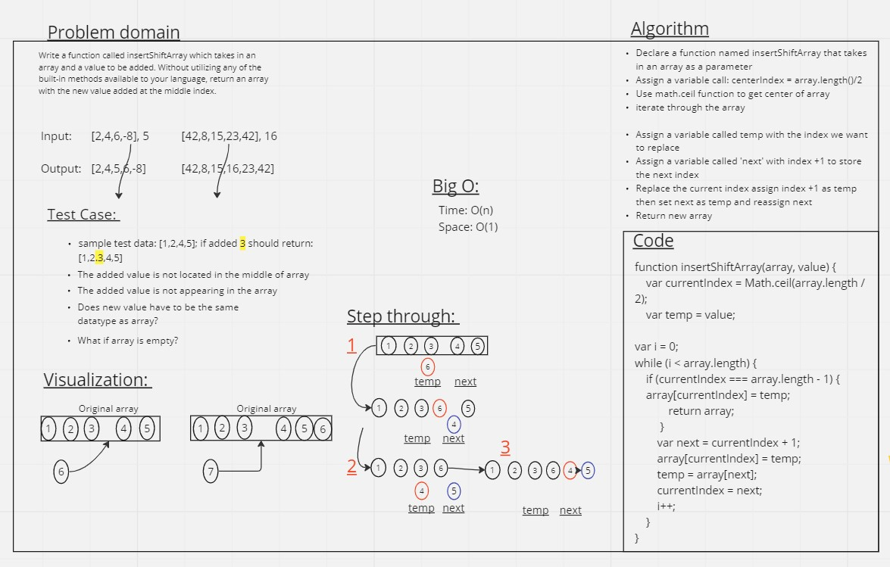

# Challenge Title:  array-insert-shift

Write a function called insertShiftArray which takes in an array and a value to be added. Without utilizing any of the built-in methods available to your language, return an array with the new value added at the middle index.

## Whiteboard Process



## Approach & Efficiency

For the "reverseArray" problem, I chose to take an iterative approach to reverse the elements of the array. This approach involves traversing the array from both ends and swapping the elements until the midpoint is reached.

The time complexity of this approach is O(n), where n is the number of elements in the array. This is because we need to visit each element once to perform the swap operations.

The space complexity is O(1) because we are modifying the array in-place without using any additional data structures.

## Solution
```
function insertShiftArray(array, value) {
  var currentIndex = Math.ceil(array.length / 2);
  var temp = value;

  var i = 0;
  while (i < array.length) {
      if (currentIndex === array.length - 1) {    
      array[currentIndex] = temp;
      return array;
    }
    var next = currentIndex + 1;
    array[currentIndex] = temp;
    temp = array[next];
    currentIndex = next;
    i++;
  }
}
```
To run the code and see examples of it in action, you can follow these steps:

1. Copy the provided code into a JavaScript file, for example, "array-insert-shift.js".
2. Open a command prompt or terminal and navigate to the directory where the file is located.
3. Run the JavaScript file using a JavaScript runtime environment such as Node.js by typing: node reverseArray.js and pressing Enter.

## Collaborators

Collaborated with Ethan Storm
