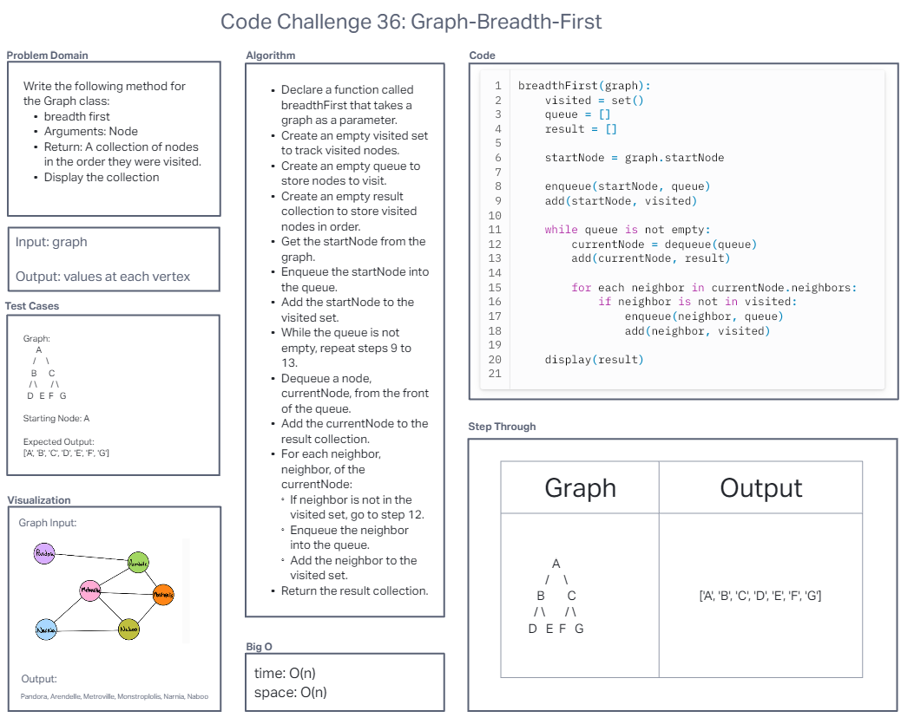
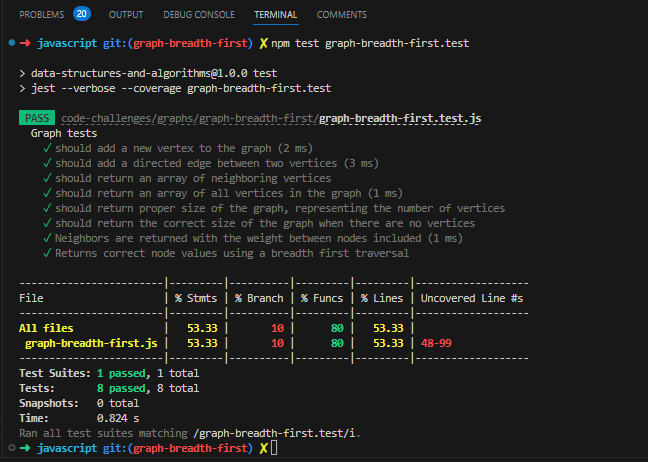

# Code Challenge 35: Graph Implementation

Implement a breadth-first traversal on a graph.

Write the following method for the Graph class:

- breadth first
- Arguments: Node
- Return: A collection of nodes in the order they were visited.
- Display the collection

## Whiteboard Process

## Approach & Efficiency
I used a breadth-first traversal approach to visit nodes in a graph. I did this because it allows me to explore the graph level by level, starting from the initial node, and ensures that I visit all reachable nodes before going deeper. This approach helps me understand the structure of the graph better and find the shortest paths if needed.

## Solution
`npm test graph.test`

