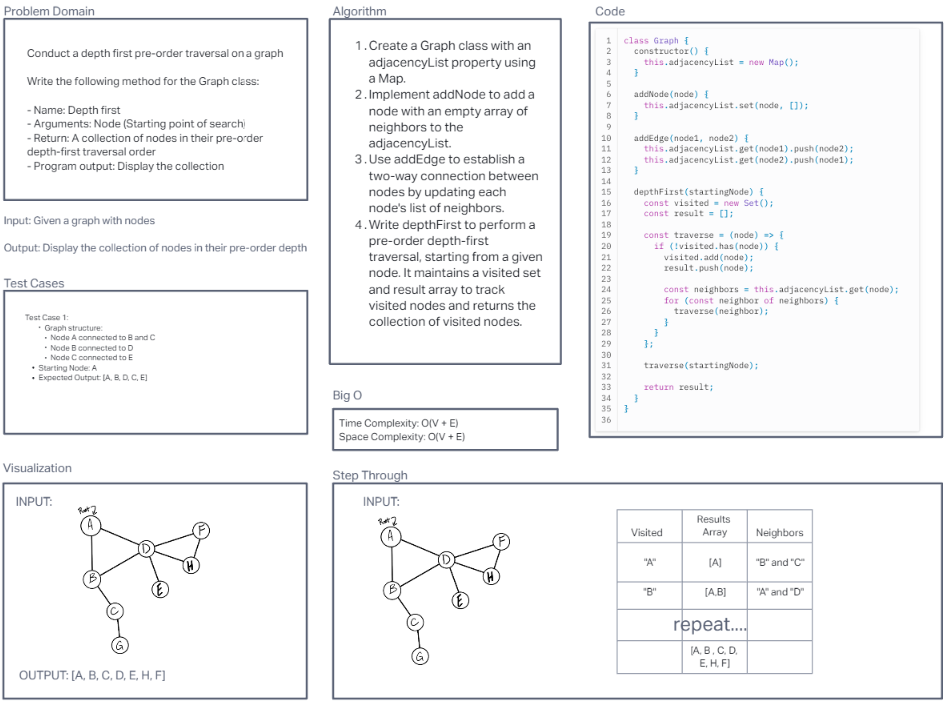
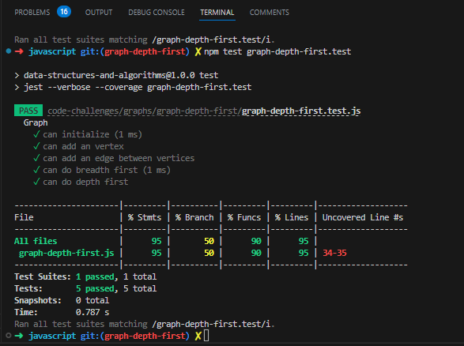

# Code Challenge 38: Graph Depth First

Conduct a depth first pre-order traversal on a graph

Write the following method for the Graph class:

- Name: Depth first
- Arguments: Node (Starting point of search)
- Return: A collection of nodes in their pre-order depth-first traversal order
- Program output: Display the collection

## Whiteboard Process

## Approach & Efficiency
I implemented a graph using an adjacency list data structure and performed a depth-first traversal using a stack. This approach allows efficient traversal of the graph by keeping track of visited nodes and using a stack to process neighbors. The time complexity is O(V + E), where V is the number of vertices and E is the number of edges in the graph. The space complexity is O(V), where V is the number of vertices, due to the space used for the stack and the visited set.

## Solution
`npm test graph-depth-first.test`

