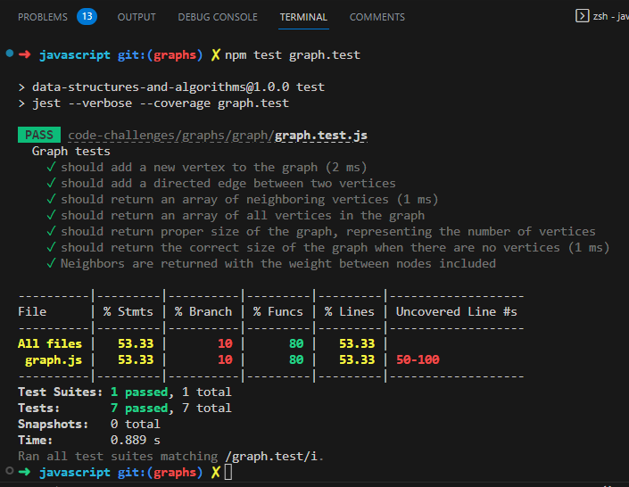

# Code Challenge 35: Graph Implementation

Implement your own Graph. The graph should be represented as an adjacency list, and should include the following methods:

- add node
  - Arguments: value
  - Returns: The added node
  - Add a node to the graph

- add edge
  - Arguments: 2 nodes to be connected by the edge, weight (optional)
  - Returns: nothing
  - Adds a new edge between two nodes in the graph
  - If specified, assign a weight to the edge
  - Both nodes should already be in the Graph

- get nodes
  - Arguments: none
  - Returns all of the nodes in the graph as a collection (set, list, or similar)
  - Empty collection returned if there are no nodes

- get neighbors
  - Arguments: node
  - Returns a collection of edges connected to the given node
    - Include the weight of the connection in the returned collection
  - Empty collection returned if there are no nodes

- size
  - Arguments: none
  - Returns the total number of nodes in the graph
  - 0 if there are none

## Whiteboard Process

Not required for thsi code challenge.

## Approach & Efficiency
I created a graph using an adjacency list representation. This approach allows me to efficiently add nodes and edges, get neighbors, and perform breadth-first and depth-first searches. The time complexity is O(1) for adding nodes and edges, and O(V + E) for traversing the graph, where V is the number of vertices and E is the number of edges. The space complexity is O(V + E) as well, since we store the adjacency list.

## Solution
`npm test graph.test`

