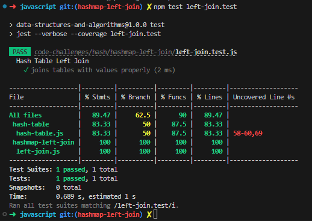

# Code Challenge 33: Map Left Join

Write a function that LEFT JOINs two hashmaps into a single data structure.

- Write a function called left join
- Arguments: two hash maps
  - The first parameter is a hashmap that has word strings as keys, and a synonym of the key as values.
  - The second parameter is a hashmap that has word strings as keys, and antonyms of the key as values.

- Return: The returned data structure that holds the results is up to you. It doesn’t need to exactly match the output below, so long as it achieves the LEFT JOIN logic

NOTES:

- Combine the key and corresponding values (if they exist) into a new data structure according to LEFT JOIN logic.
- LEFT JOIN means all the values in the first hashmap are returned, and if values exist in the “right” hashmap, they are appended to the result row.
- If no values exist in the right hashmap, then some flavor of NULL should be appended to the result row.

## Whiteboard Process

Partnered with Ethan S. on whiteboard.

## Approach & Efficiency
We took an approach where we looped through the keys of the first hashmap. For each key, we created an array called "inCommon" and added the key and its value. Then, we checked if the second hashmap had a value for that key. If it did, we added it to "inCommon"; otherwise, we added null. Finally, we added "inCommon" to the results array. This approach allows us to combine the two hashmaps according to the LEFT JOIN logic. The time complexity is O(n), where n is the number of keys in the first hashmap, and the space complexity is also O(n) because the results array grows with the number of keys.

## Solution
`npm test left-join.test`

