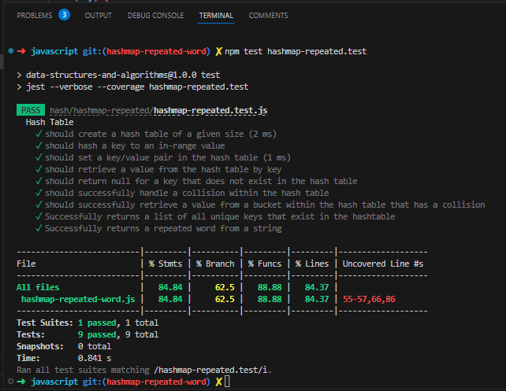

# Code Challenge 31: Hashmap Repeated Words

Find the first repeated word in a book.

- Write a function called repeated word that finds the first word to occur more than once in a string
- Arguments: string
- Return: string

## Whiteboard Process

Partnered with Reece R.

## Approach & Efficiency
We used a hashmap to store the words from the string and checked if a word was already present. This approach allows for efficient lookup and insertion, with a time complexity of O(n) and a space complexity of O(n), where n is the number of words in the string.

## Solution
`npm test hashmap-repeated.test`

