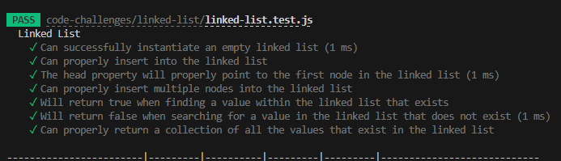
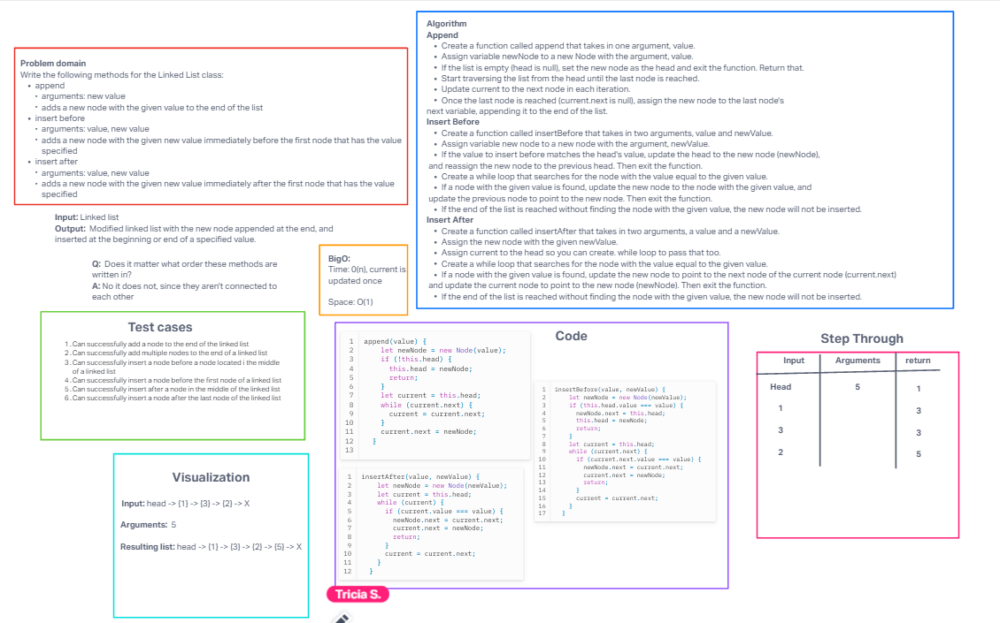
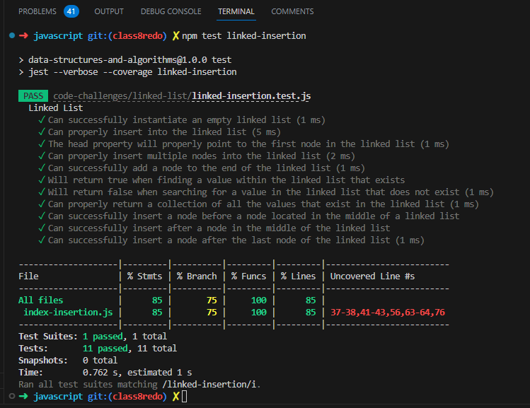
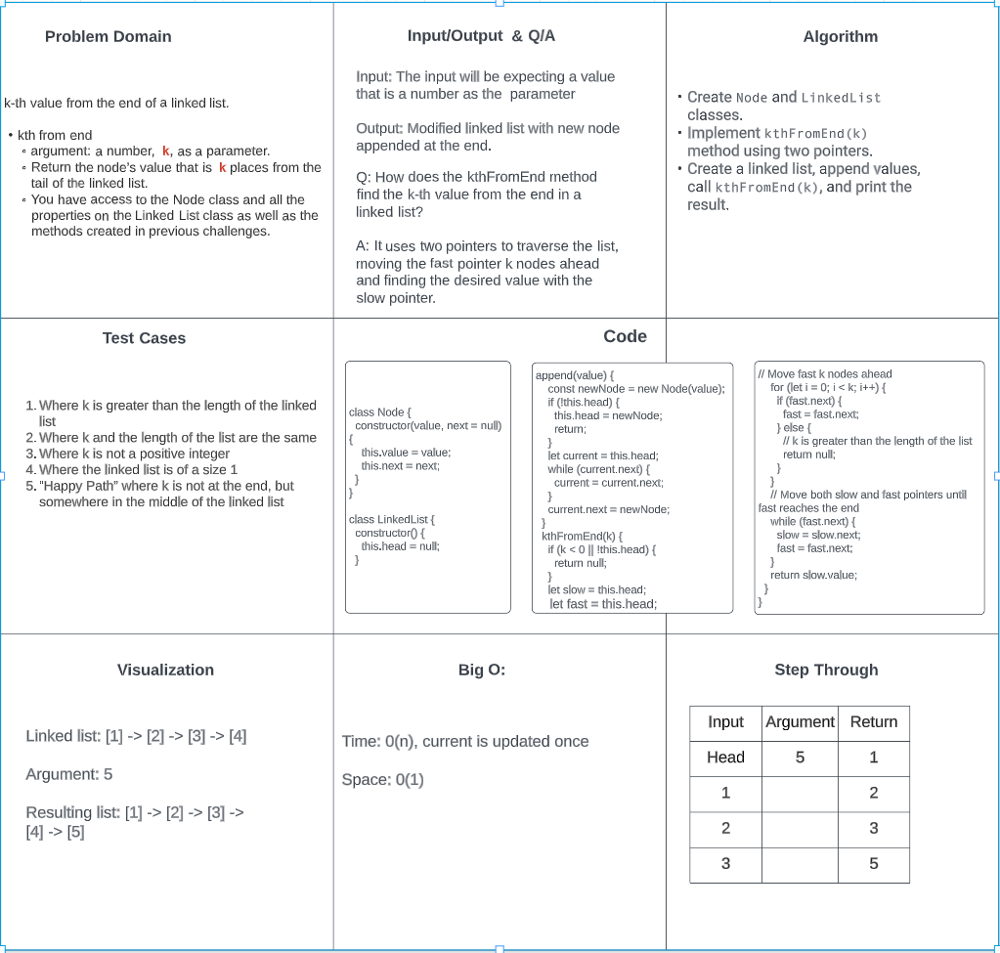
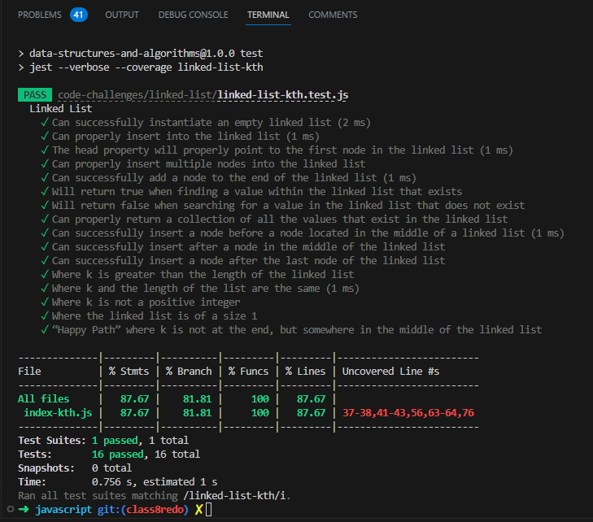
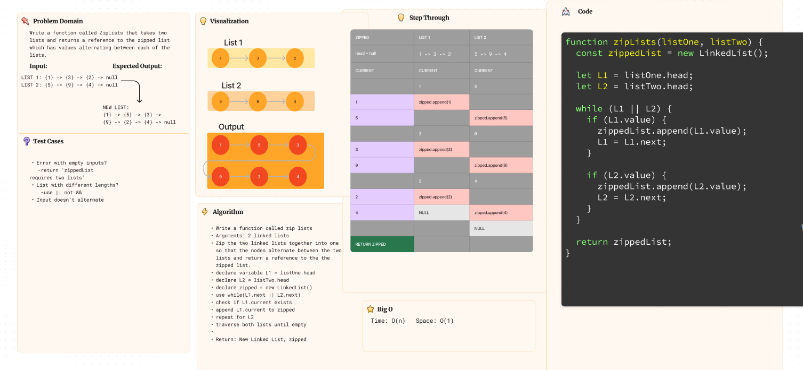
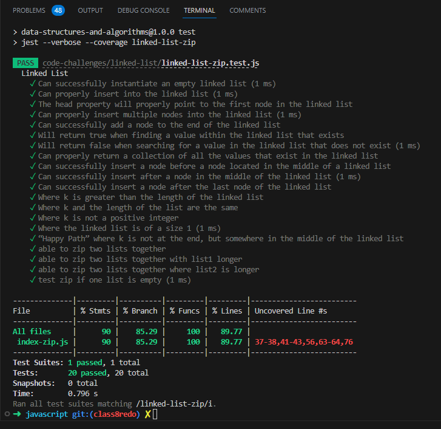

# Challenge Title:  Linked List

## Challenge 05:  Linked List Implementation
A Linked List is a sequence of Nodes that are connected/linked to each other. The most defining feature of a Linked List is that each Node references the next Node in the link.

***Implement a Singly Linked List with the following features:***

**Features**

- Node
  - Create a Node class that has properties for the value stored in the Node, and a pointer to the next Node.

- Linked List
  - Create a Linked List class
  - Within your Linked List class, include a head property.
    - Upon instantiation, an empty Linked List should be created.

  - The class should contain the following methods
    - insert
      - Arguments: value
      - Returns: nothing
      - Adds a new node with that value to the head of the list with an O(1) Time performance.

    - includes
      - Arguments: value
      - Returns: Boolean
        - Indicates whether that value exists as a Node’s value somewhere within the list.

    - to string
      - Arguments: none
      - Returns: a string representing all the values in the Linked List, formatted as:
      - "{ a } -> { b } -> { c } -> NULL"

### Whiteboard
Not needed.

### Approach & Efficiency
I created a Linked List class with a head property. I used a Node class to store values and a pointer to the next Node. I also created a separate linked-list-test.js to test the functionality of the Linked List class and ensure it behaves as expected.

### Solution

## Challenge 06: Linked List Insertion
Extend a Linked List to allow various insertion methods.

**Feature Tasks**

Write the following methods for the Linked List class:

- append
  - arguments: new value
  - adds a new node with the given value to the end of the list
- insert before
  - arguments: value, new value
  - adds a new node with the given new value immediately before the first node that has the value specified
- insert after
  - arguments: value, new value
  - adds a new node with the given new value immediately after the first node that has the value specified

### Whiteboard

Collaborated with Tricia Sawyer to do whiteboard.

### Approach & Efficiency
I approached the code challenge by traversing the linked list to locate the desired node for insertion. I then created a new node with the given value and linked it accordingly. The time complexity for these methods is O(n), as we need to iterate through the list. The space complexity is O(1), as we only create a constant number of new nodes.

### Solution

## Challenge 07: kth-from-end
Create `kthFromTheEnd` method that works with Linked List.

**Feature Tasks**

Write the following method for the Linked List class:

- kth from end
  - argument: a number, k, as a parameter.
  - Return the node’s value that is k places from the tail of the linked list.
  - You have access to the Node class and all the properties on the Linked List class as well as the methods created in previous challenges.

### Whiteboard

### Approach & Efficiency
I employed a two-pointer approach to find the k-th node from the end of the linked list. It has a time complexity of O(n) and a space complexity of O(1).

### Solution

## Challenge 08: Zip
Write a function called ZipLists that takes two lists and returns a reference to the zipped list which has values alternating between each of the lists.

**Feature Tasks**

- Write a function called zip lists
- Arguments: 2 linked lists
- Return: New Linked List, zipped as noted below
- Zip the two linked lists together into one so that the nodes alternate between the two lists and return a reference to the the zipped list.
- Try and keep additional space down to O(1)
- You have access to the Node class and all the properties on the Linked List class as well as the methods created in previous challenges.

### Whiteboard

Collaborated with Ethan Storm to do whiteboard.

### Approach & Efficiency
To zip two linked lists together alternating their nodes, I used an iterative approach. I initialized two pointers to track the current nodes of each list and manipulated their links to create the zipped list. The time complexity is O(n), and the space complexity is O(1).

### Solution

## Challenge 09: IsPalindrome
Create `zipLists` function that works with Linked List.

### Whiteboard

### Approach & Efficiency
I created a Linked List class with a head property. I used a Node class to store values and a pointer to the next Node. I also created a separate linked-list-test.js to test the functionality of the Linked List class and ensure it behaves as expected.

### Solution

# Structure and Testing

- Utilize the Single-responsibility principle: any methods you write should be clean, reusable, abstract component parts to the whole challenge. You will be given feedback and marked down if you attempt to define a large, complex algorithm in one function definition.

- Be sure to follow your language/frameworks standard naming conventions (e.g. C# uses PascalCasing for all method and class names).

- Any exceptions or errors that come from your code should be contextual, descriptive, capture-able errors. For example, rather than a default error thrown by your language, your code should raise/throw a custom error that describes what went wrong in calling the methods you wrote for this lab.

- Write tests to prove the following functionality:

  - Can successfully instantiate an empty linked list
  - Can properly insert into the linked list
  - The head property will properly point to the first node in the linked list
  - Can properly insert multiple nodes into the linked list
  - Will return true when finding a value within the linked list that exists
  - Will return false when searching for a value in the linked list that does not exist
  - Can properly return a collection of all the values that exist in the linked list
  - Ensure your tests are passing before you submit your solution.

## Approach & Efficiency
I created a Linked List class with a head property. I used a Node class to store values and a pointer to the next Node. I also created a separate linked-list-test.js to test the functionality of the Linked List class and ensure it behaves as expected.

## Solution

