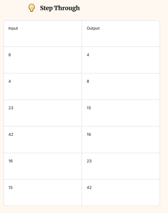
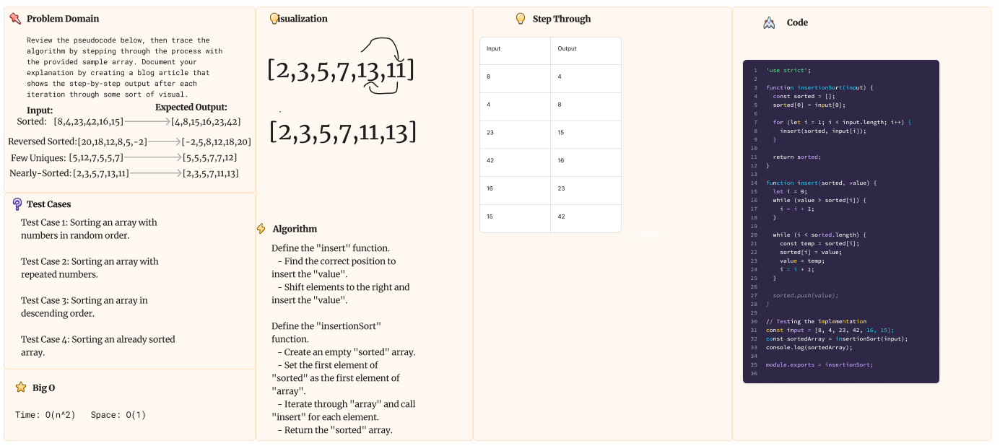
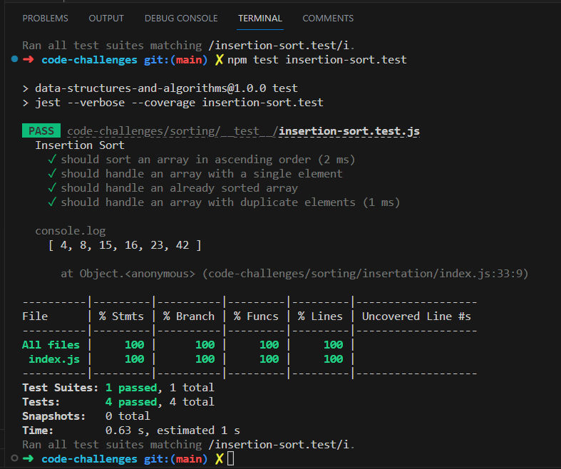

# Challenge 26: Insertion Sort

Review the pseudocode below, then trace the algorithm by stepping through the process with the provided sample array. Document your explanation by creating a blog article that shows the step-by-step output after each iteration through some sort of visual.

Once you are done with your article, code a working, tested implementation of Insertion Sort based on the pseudocode provided.

## Blog Article

To trace the algorithm for the given sample array [8, 4, 23, 42, 16, 15], we'll go through each iteration of the Insertion Sort algorithm and observe the changes in the sorted array. Here's the step-by-step process:

**Iteration 1:**

- Initial state: sorted = [8], input = [8, 4, 23, 42, 16, 15]
insert(sorted, 4):
- Compare 4 with 8. Since 4 is smaller, we insert 4 before 8.
- After the first while loop: sorted = [4, 8]

After iteration 1: sorted = [4, 8]

**Iteration 2:**

Initial state: sorted = [4, 8], input = [8, 4, 23, 42, 16, 15]
insert(sorted, 23):
- Compare 23 with 8. Since 23 is greater, we move to the next element.
- Compare 23 with 8. Since 23 is greater, we move to the next element.
- Compare 23 with the end of the sorted array, which is 8. Since 23 is greater, we insert 23 at the end.

After iteration 2: sorted = [4, 8, 23]

**Iteration 3:**

- Initial state: sorted = [4, 8, 23], input = [8, 4, 23, 42, 16, 15]
insert(sorted, 42):
- Compare 42 with 23. Since 42 is greater, we move to the next element.
- Compare 42 with the end of the sorted array, which is 23. Since 42 is greater, we insert 42 at the end.

After iteration 3: sorted = [4, 8, 23, 42]

**Iteration 4:**

- Initial state: sorted = [4, 8, 23, 42], input = [8, 4, 23, 42, 16, 15]
insert(sorted, 16):
- Compare 16 with 42. Since 16 is smaller, we move to the next element.
- Compare 16 with 23. Since 16 is smaller, we move to the next element.
- Compare 16 with 8. Since 16 is greater, we insert 16 after 8.

After iteration 4: sorted = [4, 8, 16, 23, 42]

**Iteration 5:**

- Initial state: sorted = [4, 8, 16, 23, 42], input = [8, 4, 23, 42, 16, 15]
insert(sorted, 15):
- Compare 15 with 42. Since 15 is smaller, we move to the next element.
- Compare 15 with 23. Since 15 is smaller, we move to the next element.
- Compare 15 with 16. Since 15 is smaller, we move to the next element.
- Compare 15 with 8. Since 15 is smaller, we insert 15 before 8.
- After iteration 5: sorted = [4, 8, 15, 16, 23, 42]

Final sorted array: [4, 8, 15, 16, 23, 42]

## Whiteboard Process

Collaborated with Kenya Womack on the whiteboard.

## Approach & Efficiency

I approached the problem by translating the given pseudocode into a JavaScript implementation of Insertion Sort. In the working code, I defined the insertionSort function, which takes an input array and performs the sorting operation.

Inside the insertionSort function, I initialized an empty array called sorted to store the sorted elements. I then iterated over the input array starting from index 1 and called the insert function to insert each element into the sorted array.

The insert function takes the sorted array and a value as parameters. It finds the correct position in the sorted array to insert the value by comparing it with each element. The function shifts the elements greater than the value to the right and inserts the value at the correct position.

Big O space: O(n^2)

Big O time: O(1)

## Solution

