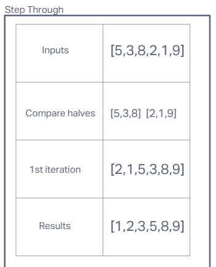
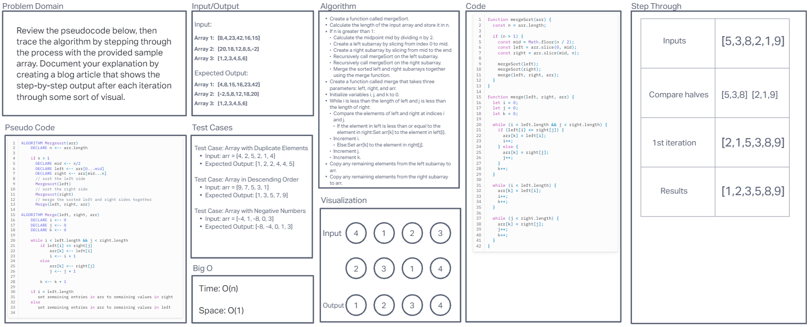
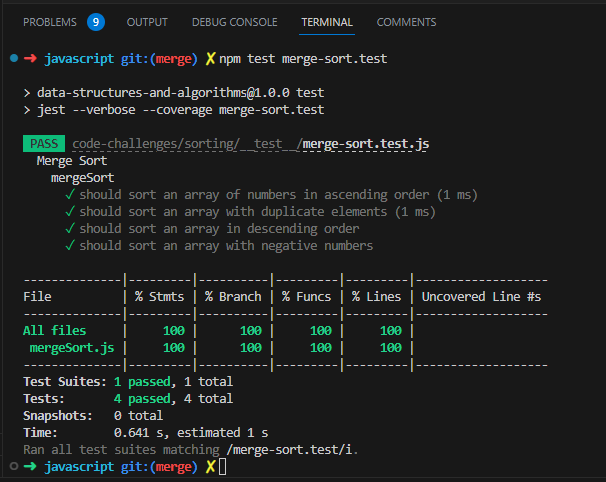

# Challenge 27: Merge Sort

Review the pseudocode below, then trace the algorithm by stepping through the process with the provided sample array. Document your explanation by creating a blog article that shows the step-by-step output after each iteration through some sort of visual.

Once you are done with your article, code a working, tested implementation of Merge Sort based on the pseudocode provided.

Pseudo Code
```
ALGORITHM Mergesort(arr)
    DECLARE n <-- arr.length

    if n > 1
      DECLARE mid <-- n/2
      DECLARE left <-- arr[0...mid]
      DECLARE right <-- arr[mid...n]
      // sort the left side
      Mergesort(left)
      // sort the right side
      Mergesort(right)
      // merge the sorted left and right sides together
      Merge(left, right, arr)

ALGORITHM Merge(left, right, arr)
    DECLARE i <-- 0
    DECLARE j <-- 0
    DECLARE k <-- 0

    while i < left.length && j < right.length
        if left[i] <= right[j]
            arr[k] <-- left[i]
            i <-- i + 1
        else
            arr[k] <-- right[j]
            j <-- j + 1

        k <-- k + 1

    if i = left.length
       set remaining entries in arr to remaining values in right
    else
       set remaining entries in arr to remaining values in left
```

## Blog Article

Merge Sort is a popular sorting algorithm known for its efficiency and simplicity. In this article, we'll explore each step of the Merge Sort algorithm using a practical example, providing a clear understanding of how it works.

Step-by-Step Explanation:

1. The input array [5, 3, 8, 2, 1, 9] is divided into two halves: [5, 3, 8] and [2, 1, 9].

2. Recursively, the Merge Sort algorithm is applied to both halves, dividing them further until single elements remain.

3. The Merge function is then invoked to merge the divided arrays.

4. During the merging process, the elements are compared and merged into a new array.

5. The merged array is further sorted until the final sorted array is obtained.

Merge Sort efficiently sorts an array by dividing it into smaller subarrays, sorting them individually, and merging them back together. By understanding the step-by-step process of Merge Sort, we can appreciate its effectiveness in sorting large datasets. Its time complexity of O(n log n) makes it a reliable choice for various applications that require efficient sorting.



## Whiteboard Process




## Approach & Efficiency

To sort an array, I define the mergeSort function. It splits the array into halves, sorts them individually, and merges them back together. This process repeats recursively until the array is sorted. It ensures that smaller elements are chosen and placed correctly. Finally, any remaining elements are added to the sorted array.

Big O Time: O(n)

Big O Space: O(1)

## Solution


