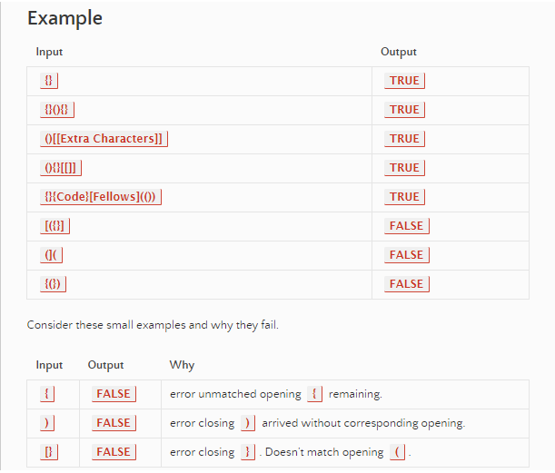
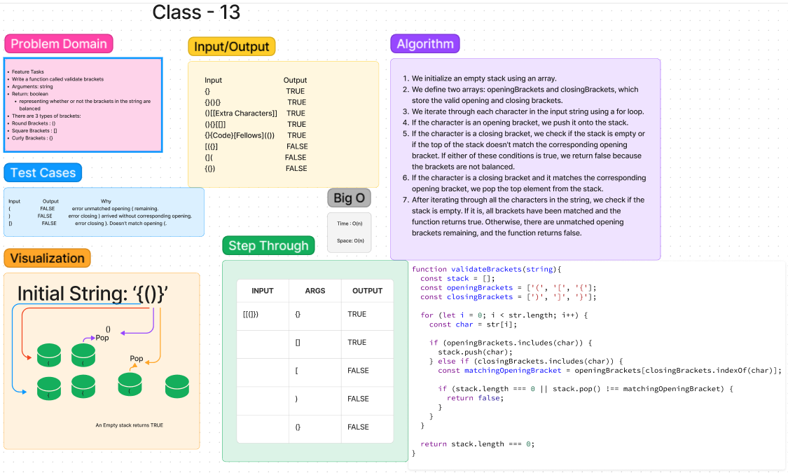
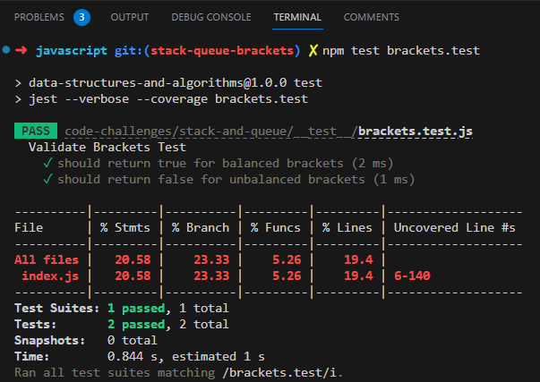

# Code Challenge 13:  Multi-bracket Validation.

## Feature Tasks

- Write a function called validate brackets
- Arguments: string
- Return: boolean
  - representing whether or not the brackets in the string are balanced

There are 3 types of brackets:

- Round Brackets : ()
- Square Brackets : []
- Curly Brackets : {}

## Whiteboard Process

Collaborated with Eva Grace Smith on creating the whiteboard.

## Approach & Efficiency
We took a stack-based approach to validate the balance of brackets. This approach allows us to check for matching opening and closing brackets using a Last-In-First-Out (LIFO) structure. The time complexity of this approach is O(n), where n is the length of the input string, and the space complexity is O(n) as well, considering the worst-case scenario where all opening brackets are present and stored in the stack.

## Solution

To run test run 'npm test bracket.test' in terminal.

