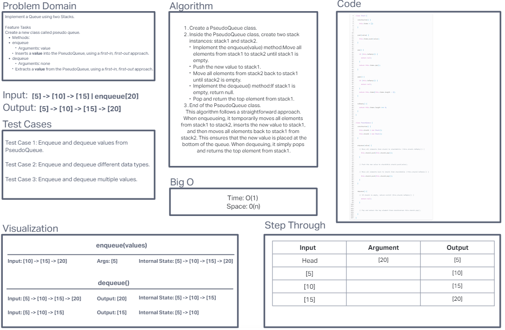
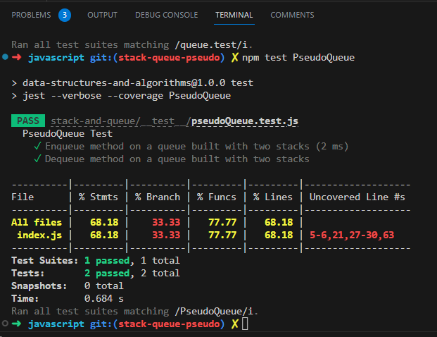

# Challenge Title 10:  Implement a Queue using two Stacks

## Feature Tasks

- Create a new class called pseudo queue.
  - Do not use an existing Queue.
  - Instead, this PseudoQueue class will implement our standard queue interface (the two methods listed below),
  - Internally, utilize 2 Stack instances to create and manage the queue

- Methods:
  - enqueue
    - Arguments: value
    - Inserts a value into the PseudoQueue, using a first-in, first-out approach.
  - dequeue
    - Arguments: none
    - Extracts a value from the PseudoQueue, using a first-in, first-out approach.

NOTE: The Stack instances have only push, pop, and peek methods. You should use your own Stack implementation. Instantiate these Stack objects in your PseudoQueue constructor.

## Whiteboard Process

Collaborated with Hayden Cooper on creating the whiteboard.

## Approach & Efficiency
I used two stacks to implement the PseudoQueue, pushing values into the first stack and transferring them to the second stack for dequeueing. The time/space complexity is O(n).

## Solution

To run test run 'npm test pseudoQueue.test' in terminal.

