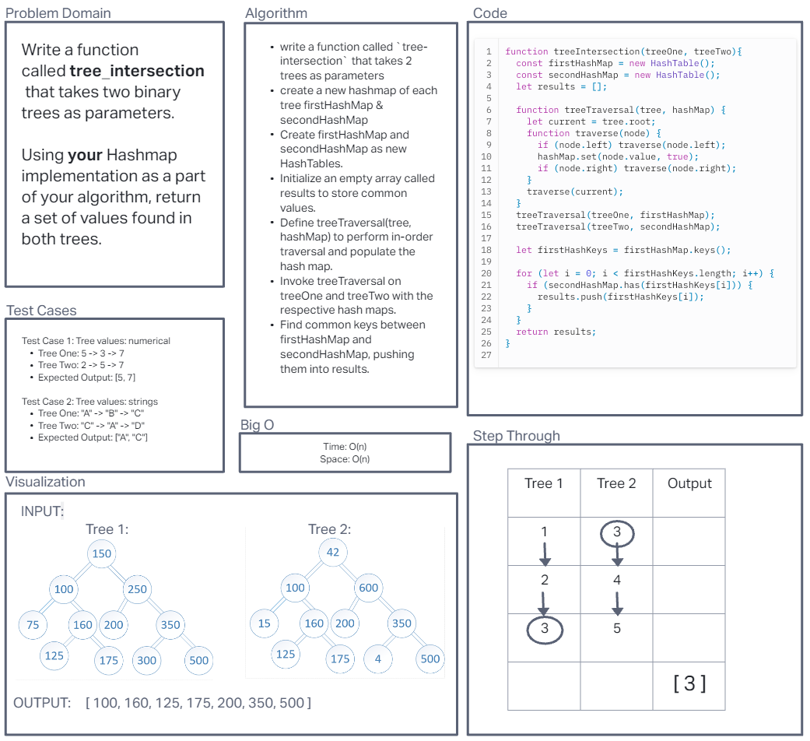

# Code Challenge 32: B-Tree Intersection

- Write a function called `tree_intersection` that takes two binary trees as parameters.

- Using your Hashmap implementation as a part of your algorithm, return a set of values found in both trees.

## Whiteboard Process

## Approach & Efficiency
I used a hashmap approach to find the common values in two binary trees. I stored values of each tree in separate hashmaps and checked for common values. The time complexity is O(n), and space complexity is O(m), where n is the number of nodes in the larger tree and m is the number of distinct values in both trees.

## Solution

