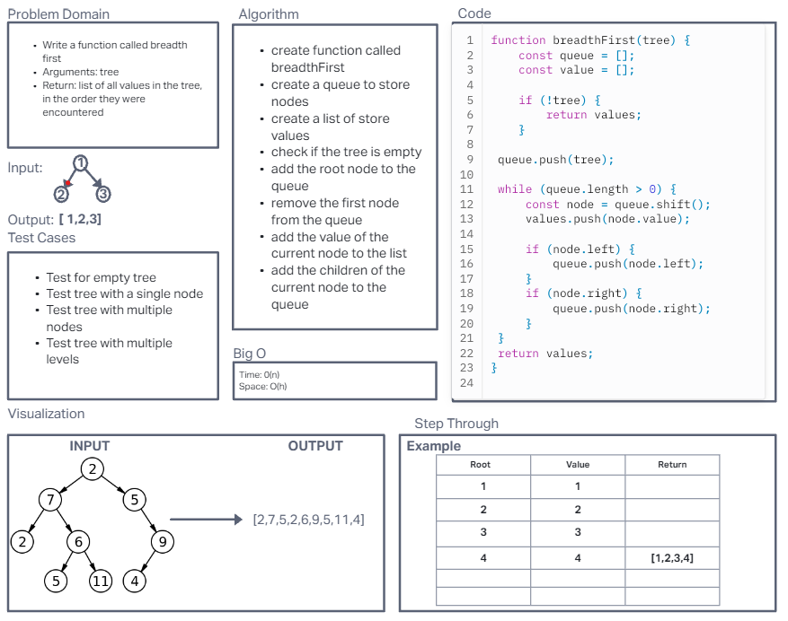
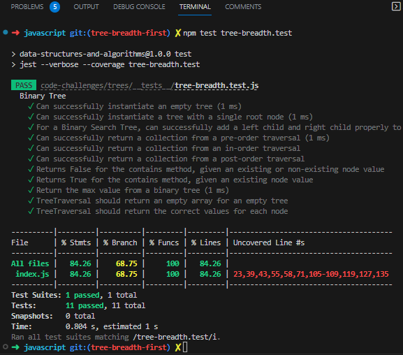

# Challenge Title:  Breadth-first Traversal

## Challenge 17:  Return a list of all values in the tree, in the order they were encountered

**Features**

- Write a function called breadth first
- Arguments: tree
- Return: list of all values in the tree, in the order they were encountered

NOTE: Traverse the input tree using a Breadth-first approach

### Whiteboard

### Approach & Efficiency
I used a breadth-first search approach to traverse the tree. It helps explore all nodes at each level before moving to the next level. The time complexity is O(n) and the space complexity is O(h), where n is the number of nodes and h is the height of the tree.

### Solution

