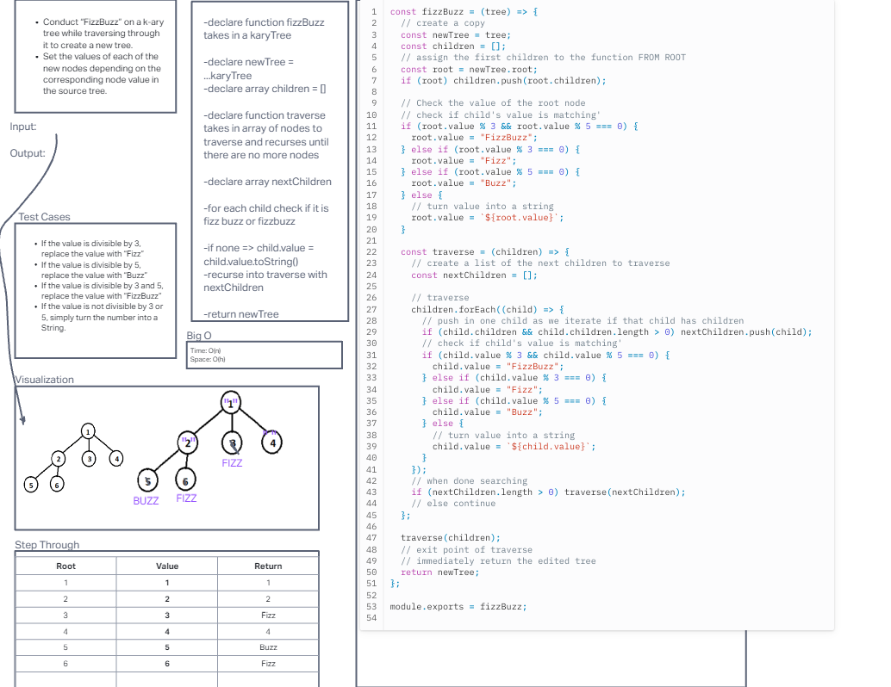

# Challenge Title:  Trees Fizz Buzz

## Challenge 18:  Conduct “FizzBuzz” on a k-ary tree while traversing through it to create a new tree.

Conduct “FizzBuzz” on a k-ary tree while traversing through it to create a new tree.

Set the values of each of the new nodes depending on the corresponding node value in the source tree.

**Features**

- Write a function called fizz buzz tree

- Arguments: k-ary tree

- Return: new k-ary tree

Determine whether or not the value of each node is divisible by 3, 5 or both. Create a new tree with the same structure as the original, but the values modified as follows:

- If the value is divisible by 3, replace the value with “Fizz”
- If the value is divisible by 5, replace the value with “Buzz”
- If the value is divisible by 3 and 5, replace the value with “FizzBuzz”
- If the value is not divisible by 3 or 5, simply turn the number into a String.

### Whiteboard

### Approach & Efficiency
I used a recursive approach to perform FizzBuzz on the k-ary tree. Recursion simplifies tree traversal and allows handling each node individually. The space complexity is O(h), where h is the height of the tree, as it depends on the maximum depth of the recursion stack. The time complexity is O(N), where N is the total number of nodes in the tree, as we visit each node once during the traversal.

### Solution

