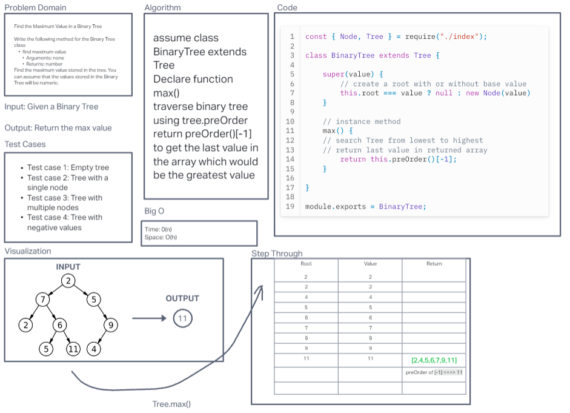
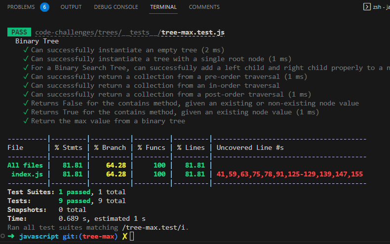

# Challenge Title:  Trees Max

## Challenge 16:  Find the Maximum Value in a Binary Tree
Given a binary tree with numeric values, find the maximum value stored within the tree.

**Features**

Write the following method for the Binary Tree class

- find maximum value
  - Arguments: none
  - Returns: number

Find the maximum value stored in the tree. You can assume that the values stored in the Binary Tree will be numeric.

### Whiteboard

### Approach & Efficiency
I used a recursive approach to find the maximum value in the Binary Tree. It simplifies the implementation and matches the tree structure. The time complexity is O(n), and the space complexity is O(h).

### Solution

