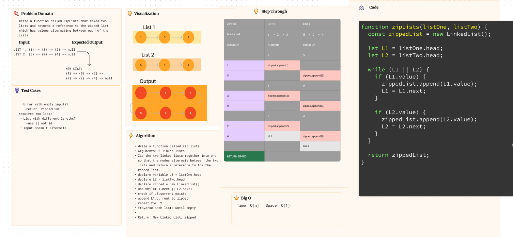

# Challenge Title: Linked List zip
Write a function called ZipLists that takes two lists and returns a reference to the zipped list which has values alternating between each of the lists.

**Feature Tasks**

- Write a function called zip lists
- Arguments: 2 linked lists
- Return: New Linked List, zipped as noted below
- Zip the two linked lists together into one so that the nodes alternate between the two lists and return a reference to the the zipped list.
- Try and keep additional space down to O(1)
- You have access to the Node class and all the properties on the Linked List class as well as the methods created in previous challenges.

## Whiteboard Process

## Approach & Efficiency
The code uses a two-pointer approach to find the k-th value from the end of a linked list. It is efficient with a time complexity of O(N) and a space complexity of O(1).

## Solution
<!-- Show how to run your code, and examples of it in action -->
