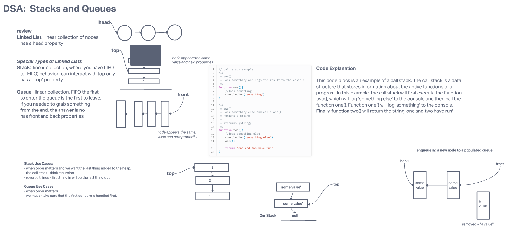
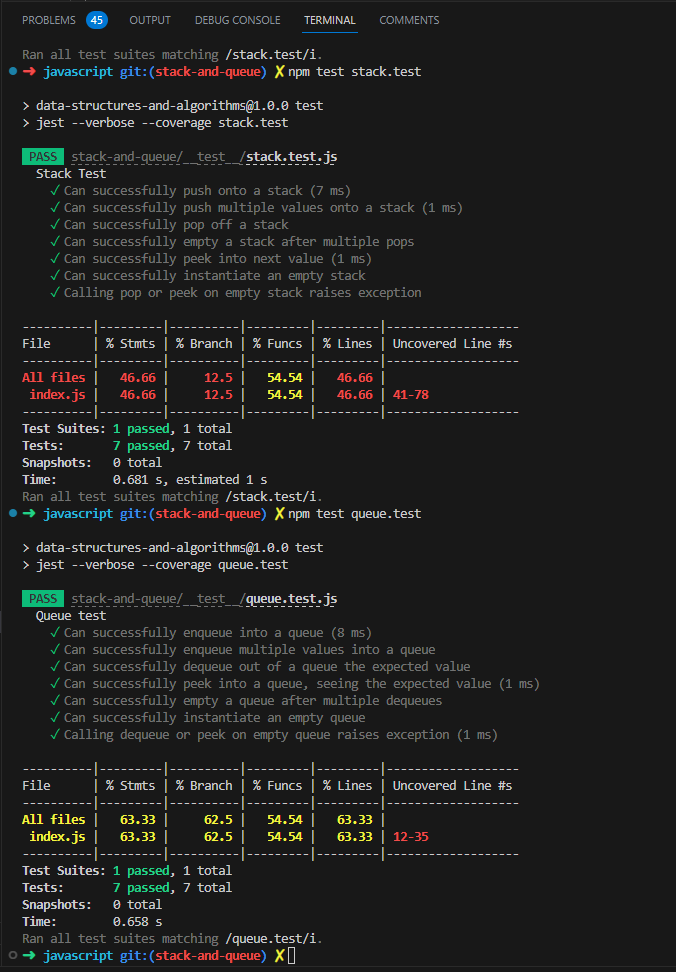

# Challenge Title:  Stack and a Queue Implementation

## Features
Using a Linked List as the underlying data storage mechanism, implement both a Stack and a Queue.

**Node**

- Create a Node class that has properties for the value stored in the Node, and a pointer to the next node.

**Stack**
- Create a Stack class that has a top property. It creates an empty Stack when instantiated.
  - This object should be aware of a default empty value assigned to top when the stack is created.
  - The class should contain the following methods:
  - push
    - Arguments: value
    - adds a new node with that value to the top of the stack with an O(1) Time performance.
  - pop
    - Arguments: none
    - Returns: the value from node from the top of the stack
    - Removes the node from the top of the stack
    - Should raise exception when called on empty stack
  - peek
    - Arguments: none
    - Returns: Value of the node located at the top of the stack
    - Should raise exception when called on empty stack
  - is empty
    - Arguments: none
    - Returns: Boolean indicating whether or not the stack is empty.

**Queue**

- Create a Queue class that has a front property. It creates an empty Queue when instantiated.
  - This object should be aware of a default empty value assigned to front when the queue is created.
  - The class should contain the following methods:
  - enqueue
    - Arguments: value
    - adds a new node with that value to the back of the queue with an O(1) Time performance.

  - dequeue
    - Arguments: none
    - Returns: the value from node from the front of the queue
    - Removes the node from the front of the queue
    - Should raise exception when called on empty queue
  - peek
    - Arguments: none
    - Returns: Value of the node located at the front of the queue
    - Should raise exception when called on empty stack
  - is empty
    - Arguments: none
    - Returns: Boolean indicating whether or not the queue is empty

You have access to the Node class and all the properties on the Linked List class.

## Whiteboard Process
Whiteboard taken from in class demo.

## Approach & Efficiency
For implementing the Stack and Queue using a Linked List, I created separate classes for both data structures. Each class has its respective methods for performing operations like push, pop, enqueue, dequeue, peek, and isEmpty.

The underlying data storage mechanism, Linked List, allows for efficient insertion and deletion at the beginning and end of the list, resulting in an O(1) time complexity for these operations. The space complexity is also O(1) as we only require additional memory to store the nodes and the references to the top/front elements.

## Solution
To run Stack test run 'npm test stack.test' in terminal.

To run Queue test run 'npm test queue.test' in terminal.

