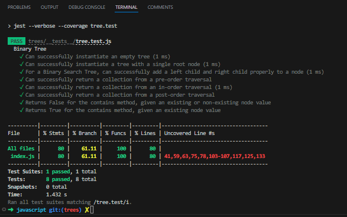

# Challenge Title:  Trees

## Challenge 15:  Binary Tree and BST Implementation
A set of classes is created to work with nodes, binary trees, and binary search trees. The classes enable operations like depth-first traversals, adding nodes to the tree, and checking if a specific value exists within the binary search tree.

***Implement a Singly Linked List with the following features:***

**Features**

- Node
  - Create a Node class that has properties for the value stored in the node, the left child node, and the right child node.

- Binary Tree
  - Create a Binary Tree class
    - Define a method for each of the depth first traversals:
      - pre order
      - in order
      - post order
    - Each depth first traversal method should return an array of values, ordered appropriately.

- Binary Search Tree
    - Create a Binary Search Tree class
      - This class should be a sub-class (or your languages equivalent) of the Binary Tree Class, with the following additional methods:
      - Add
        - Arguments: value
        - Return: nothing
        - Adds a new node with that value in the correct location in the binary search tree.
      - Contains
        - Argument: value
        - Returns: boolean indicating whether or not the value is in the tree at least once.

### Whiteboard
Not needed.

### Approach & Efficiency
The implementation includes separate classes for Node, Binary Tree, and Binary Search Tree, enabling operations like traversals, adding nodes, and value checking. Time complexity: O(n), space complexity: O(n).

### Solution

